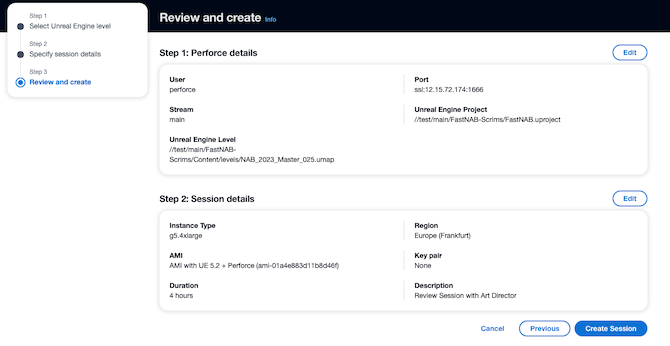
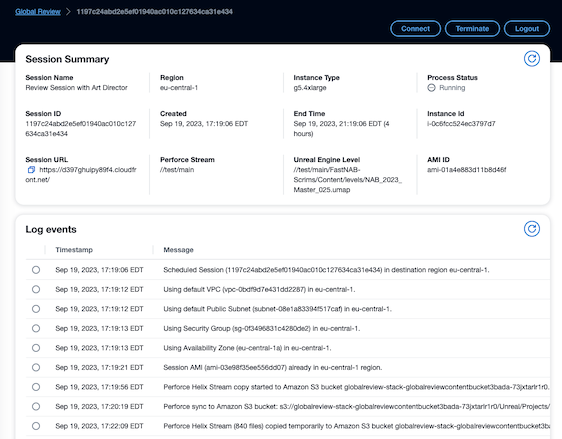
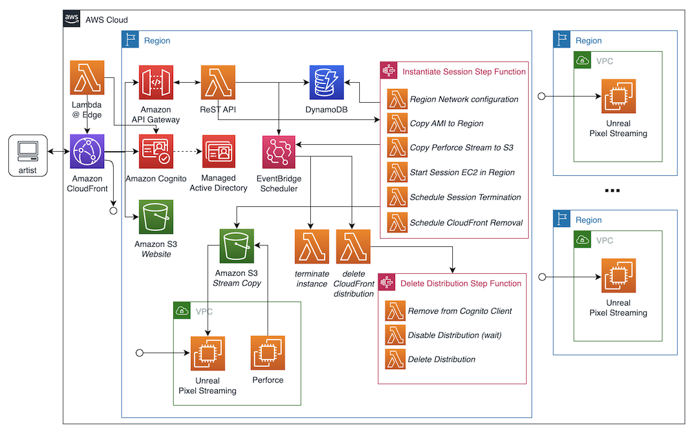

# Unreal Global Review Project Placeholder

This is the Unreal Global Review Project Placeholder. The intent to release this project on github.com with a MIT-0 very permissive open source license once beta has completed. Once released on the AWS github account, this page and the link will be updated.

## Presentation

## Screenshots

The browser UI is written in React using the [https://cloudscape.design/](Cloudscape designs) widget set.

### Creating a session.

### Session Details

## Architecture

The backend is written in Python.

