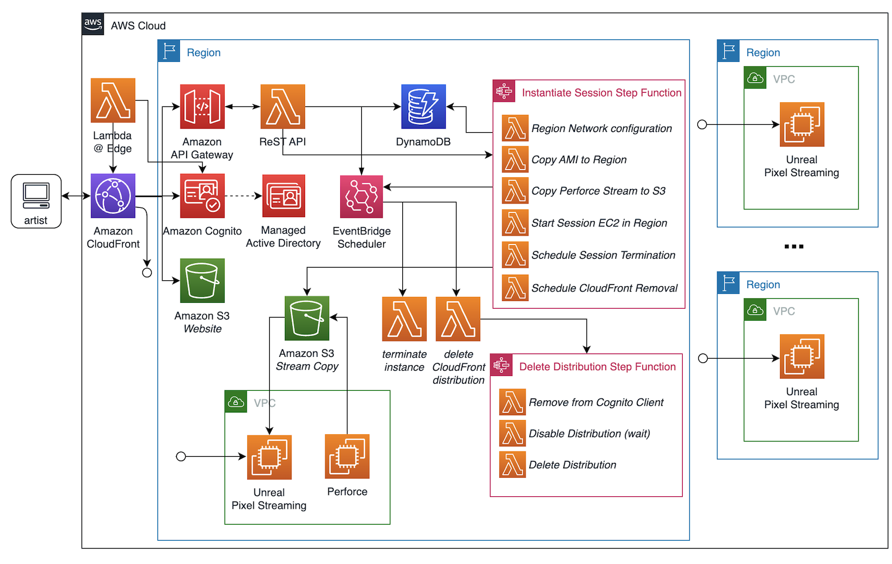

# Unreal Global Review

This serves as a reference architecture. Originally built for Unreal Engine 5.3.
 
## Overview

The Unreal Global Review project allows easy-to-use review of 3D production assets on an Unreal Engine system running in the cloud streaming to a browser. The solution deploys an adminiatrative website using serverless technology that allows for quick and easy deployment of an Unreal Engine production project on an GPU-based EC2 in any region around the world for short periods of time. The running Unreal Engine will pixel stream the 3D viewport using built-in WebRTC streaming technology to the clients browser (use case deliverable is an iPad running Safari). The Unreal webRTC player provides camera controls that will interact with the Unreal 3D scene. The supplied Unreal webRTC player will need to support login credentials to access the Unreal 3D review and approval system.

## Contributors

- Lead: Patrick Palmer (pxpalmer@amazon.com)
- Rymesha Fason (rfason@amazon.com)
- Frank Mullerat (frmuller@amazon.com)
- Jerry Tejada (tejjerry@amazon.com)
- Zach Willner (zwillner@amazon.com)

## Installation

The installation of Global Review is a multi-step process. The steps are as follows:

1. Front-end build.
2. Settings configuration.
3. Deploy the project to an AWS account.
4. Build an Unreal Engine AMI.
5. User creation.

### Frontend Build

Builds the app for production to the `build` folder. It correctly bundles React in production mode and optimizes the build for the best performance. The build is minified and the filenames include the hashes. Make sure the `.env.local` file doesn't exist when building.

```
cd frontend
npm run build
```

### Settings configuration

This project uses AWS Cloud Development Kit (AWS CDK) which is a framework for defining cloud infrastructure in code and provisioning it through AWS CloudFormation.

With AWS CDK, context parameters are key-value pairs that provide configuration data to a CDK app. They allow users to specify external configuration in the CDK to modify the behavior of the CDK app. Context values can be set in various ways, including through the CDK command line interface or via the CDK `cdk.context.json` file.

Context parameters become fixed once the CDK app is synthesized into a CloudFormation template.

The settings are arranged to support multiple environments like `prod` and `stage`.

The postfix context parameter is essential for each environment and cannot remain unset by default. This parameter plays a role in determining the Amazon Cognito Domain name, which mandates global uniqueness. If this postfix context parameter is left unset, the CDK will produce an error. Furthermore, if a user chooses a postfix value that's already taken, the deployment is likely to encounter failure.

### Deployment

All AWS CDK developers, even those working in Python, Java, or C#, need Node.js 10.13.0 or later. All supported languages use the same backend, which runs on Node.js. We recommend a version in active long-term support, which, at this writing, is the latest 18.x release. Your organization may have a different recommendation.

You must configure your workstation with your AWS Account credentials and an AWS region, if you have not already done so. If you have the AWS CLI installed, the easiest way to satisfy this requirement is issue the following command:

```sh
aws configure
```

Provide your AWS access key ID, secret access key, and default region when prompted.

Have Python 3.9 or later including pip and virtualenv (in case of this project that uses python as language)

To manually create a virtualenv:

```sh
python3 -m venv .venv
```

After the init process completes and the virtualenv is created, you can use the following
step to activate your virtualenv.

```sh
source .venv/bin/activate
```

Once the virtualenv is activated, you can install the required dependencies.

```sh
pip install -r requirements.txt
```

At this point you are redy to deploy the stacks in your account. The command below deploys the whole project at once.

```sh
$ cdk deploy --all
```

If you get the error "Domain already associated with another user pool.", you need to select a different postfix in the cdk.context.json.

### Unreal Engine AMI

Global Review project uses a Windows based AMI instance types. Here are the steps to build an AMI from scratch.

**1. Launch Windows 2022 EC2**

1. Pick an Instance Type (recommended G4 or G5 type).
2. Configure root volume to have at least 128GB.
3. Choose a VPC and a public subnet.
4. Choose or create a Key Pair.
5. Create a new Security Group:

- For NICE DCV: Add TCP and UDP on port 8443 to inbound rules. Set the source ip to "My IP".
- For Pixel Streaming: Add TCP & UDP on ports 8888 & 80. Set the source ip to "My IP".

6. Use an IAM role with S3 permissions.

- This is needed to copy the NVidia driver from the Amazon S3 bucket.

**2. Install Core Components**

1. NICE DCV Windows x64_64 Server.

- Enable QUIC protocol via Registry setting.

2. NVidia Graphics Grid driver.

**3. Connect to Unreal Engine EC2**

Use NICE DCV to connect to the running instance.

**4. Install Epic Games Unreal Engine**

1. Install Epic Games Launcher.
2. Login Epic Games Launcher.
3. Install latest Unreal Engine.

- Review options and only install Windows platform
- Recommended to install into a directory path without a space in it (i.e., C:\UE_5.3)

4. Run Batch Commands to install Pixel Streaming software (optional).

- {UnrealInstallDir}/Engine/Plugins/Media/PixelStreaming/Resources/WebServers/get_ps_servers.bat
- {UnrealInstallDir}/Engine/Plugins/Media/PixelStreaming/Resources/WebServers/SignallingWebServer/platform_scripts/cmd/setup.bat

5. Launch Unreal Engine at least once.

**5. Generate new AMI image based on Unreal Engine instance**

From the Amazon EC2 Instances view, you can create Amazon Machine Images (AMIs) from either running or stopped instances. For more detailed information about AMIs, see the Amazon Machine Images (AMI) topic in the Amazon Elastic Compute Cloud User Guide for Windows Instances.

To create an AMI from an instance

1. In the Instance summary page, choose "Create Image" in the Actions -> Image and Templates menu.

2. In the Create Image dialog page, type a unique name and description, and then choose Create Image. By default, Amazon EC2 shuts down the instance, takes snapshots of any attached volumes, creates and registers the AMI, and then reboots the instance.

It may take a few minutes for the AMI to be created. After it is created, it will appear in the AMIs view in Images section of the EC2 service page. When the AMI first appears, it may be in a pending state, but after a little bit, it transitions to an available state.

### User Creation

Global Review uses AWS Cognito for user identities and authentication. The steps to create a user:

1. Log into AWS Console.
2. Select the us-east-1 region.
3. Traverse to the Amazon Cognito Service Page.
4. Select the `GlobalReview-Auth-Cognito-UserPool` User Pool.
5. Create a user.

## Design

The Global Review system was designed to use the AWS Serverless cloud computing model which allows for running of applications without having to manage the traditional server infrastructure. There is no need to worry about server provisioning, patching or OS maintenance. With AWS Serverless, you pay only for the compute resources consumed during the execution of the project. There are no upfront fees or ongoing costs for idle server capacity. AWS Serverless is well-suited for this use case as it reduces operational overhead and optimizes costs.

### AWS Services

Amazon Identity and Access Management (Amazon IAM) is a fundemental security service enabling mangement of access to AWS resources by controlling who can perform actions on what resources. IAM allows organizations to set up and enforce access controls, ensuring that users and applications have the appropriate level of access while maintaining a high level of security for AWS resources. IAM encourages the practice of granting only the minimum required permissions to users, groups, and roles. This reduces the risk of accidental or intentional misuse of AWS resources.

Amazon Elastic Compute Cloud (Amazon EC2) is a core compute service providing scaleable and resizable virtual services. EC2 instances support a variety of operating systems including Amazon Linux, Ubuntu and Windows Server. The EC2 instances are secured using Security groups to control inbound and outbound traffic.

AWS CloudFront is a content delivery services and it's designed to help accelerate the delivery of content to end-users by distributing it through a global network of edge locations. CloudFront is a key component in building highly responsive, low-latency, and high-performance web applications. CloudFront is seemlessly integrated with other AWS services, such as Amazon S3, EC2, Lambda and API Gateway, making it a crucial component of serverless and containerized application architectures. CloudFront has behavior settings and path pattern routing to direct specific URL paths to different origin servers. For Global Review, `/api/*` sends the requests to the API Gateway.

Amazon Cognito is a versatile service that simplifies the process of managing user identites, securing authentication and authorizing access to AWS resources. It is particularly useful for adding user registration, login and access control to an application. Cognito has support for:

- Federated identities.
- Authentication including multi-factor authentication, adaptive authentication, and user password and email/phone number verification.
- Security best practices for handing common threats as account enumeration and brute-force attacks.
- Provides Analytics for user activity and useage patterns.

AWS API Gateway enables the creation of ReSTful APIs and Websocket API connected to AWS Lambda functions.

AWS Step Functions service is for creating and coordinating serverless workflows by orchestrating multiple AWS services. It's useful for building complex, multi-step applications.

AWS EventBridge Scheduler allows for triggering events using a time-based schedule or a rate expression. When a scheduled event is triggered, a wide rage of actions can be performed in response including AWS services, Lambda functions and other event bus options. This allows for automating of various tasks including mainteance, generating reports, triggering backup processes, and more.

### Architecture

Here is the high level AWS architecture diagram of the Global Review project.



#### Unreal Engine EC2

Unreal Engine is instantiating on EC2 with a user-specified Windows AMI. Here are the steps executed at the start of the Windows Unreal Engine instance (using User Data):

1. Install Unreal Pixel Streaming server (not installed by default).
2. Setup STUN/TURN Web Server.
3. Install AWS CLI command.
4. Turn off firewall.
5. Copy Unreal Engine project from S3.
6. Start Web Server.
7. Start Unreal Editor with Pixel Streaming.

Starting of Unreal Editor can take a long time as the entire project needs to be rebuilt including caching and rebuilding of materials.

The Unreal Engine WebRTC Pixel Streaming server starts without using a secure certificate. This means communications directly to the WebRTC server are not secure. By limiting all communications to the Unreal Engine instance through Amazon CloudFront, means the communication will be secure (both HTTPS and Web Sockets (wss)) over the internet.

EC2 are given the IAM role permission "AmazonSSMManagedInstanceCore" which allows for Session Manager (SSM) to manage the instance. Plus, you can connect to the instance using SSM in the EC2 AWS console.

#### User Interface

The browser-based user interface (UI) is developed using a combonation of modern web technologies.

1. **React**. React is a popular JavaScript library developed by Facebook for building user interfaces.
2. **AWS Amplify**. AWS Amplify is a set of tools to help front-end web developers write applications. Amplify provides the mechanism to validate and verify authentication.

#### ReSTful API

The ReSTful API is designed using Python, leveraging the power and efficiency of the FastAPI framework. By utilizing FastAPI, the API benefits from automatic interactive API documentation, type checking and modern asynchronous capabilities that Python offers.

Furthermore, this API is encapsulated as a singular AWS Lambda function. By deploying the ReSTful API as a Lambda function, the system ensures scalability, flexibility, and cost efficiency.

#### Perforce Helix Core service

The user credentials for Perforce Helix are safely stored in the AWS Systems Manager Parameter Store (secure string), enabling the Unreal Engine project to be transferred from the Helix stream during the Step Function process. After the project is successfully transferred to Amazon S3, these credentials are promptly removed from the Parameter Store. Importantly, these credentials aren't stored in any other location and are retained only for a brief duration. Moreover, when the project is fetched from Perforce Helix, it doesn't establish a Helix workspace.

#### User Authentication

Global Review is rolled out through two AWS CDK stacks. The initial stack, `GlobalReviewAuth`, deploys the Lambda @ Edge functions and the Amazon Cognito User Pool exclusively to the us-east-1 region. It's imperative to note that Lambda @ Edge functions can only be deployed in the us-east-1 region. Conversely, the subsequent stack, named `GlobalReview`, is launched in a region specified by the user.

### (Optional) Federated Login

Users can also configure Global Review with Federated Login. This allows users to leverage credentials from an existing Microsoft Active Directory (AD) to log into the Global Review web aplication. To achieve this configuration users need to integrate their own Microsoft AD with the Cognito User Pool. They can use a SAML 2.0 compliant IdP such AWS Identity Center to add it as an indetity provider in the Amazon Cognito User Pool previously deployed in the `GlobalReviewAuth` stack. This is a summarized outline of the steps required:

**With AWS Identity Center**

1. **Connecting Microsoft AD to AWS IAM Identity Center:** Using the AWS Directory Service we can conenct a self-managed or an AWS Managed Microsoft AD to AWS IAM Identity Center. We can set up the Identity Source of the AWS IAM Identity Center to be the self-managed or AWS Managed Microsoft AD, where we will administer users and groups.
2. **Configure a SAML application from the IAM Identity Center:** Next we need to add a custom SAML 2.0 application to our AWS IAM Identity Center. After adding a Display Name and Description, we need to modify the application metadata and provide the following values from our Cognito User Pool:

- **Application Assertion Consumer Service (ACS) URL:** https://<domain-prefix>.auth.<region>.amazoncognito.com/saml2/idpresponse
- **Application SAML audience:** urn:amazon:cognito:sp:<userpool-id>

Finally, we also need to modify the attribute mappings section. At a basic level we can mapp the user email attribute:

User attribute in the application: **subject**
**Note: subject** is prefilled.
Maps to this string value or user attribute in IAM Identity Center: **${user:subject}**
Format: **Persistent**

User attribute in the application: **email**
Maps to this string value or user attribute in IAM Identity Center: **${user:email}**
Format: **Basic**

The mapped attributes are sent to Amazon Cognito when signing in. Make sure that all your user pool's required attributes are mapped here. To learn more about attributes available for mapping, see Supported IAM Identity Center attributes. Save the changes and choose the **Assign Users** button to assign users to the application.

3. **Configure IAM Identity Center as a SAML IdP in your user pool:** After configuring the SAML Application on AWS Identity Center, we need to configure Identity Center as a SAML Identity Provider (IdP) in our Cognito User Pool. Within the configuration you need t provide the **Metadata document**, which you can do by providing the metadata URL of AWS Identity Center, and enter your SAML Provider name of choice. Finally, you also need to set up the SAML provider attribute mapping following the convention you used in Step 2.

4. **Integrate the IdP with the user pool app client:** In the last step, you need to navigate to the App Integration tab within your Cognito User Pool and choose the client generated by the stack. From the Hosted UI wizard click edit, and select the appropriate IdP which can be identified by the name set in step 3. You can choose to allow both users from the SAML IdP and Cognito User Pool to access the Global Review application or just one of the two.

**Connect a Self-managed directory in Active Directory to IAM Identity Center**

User can also choose to leverage an existing on-premises Microsoft Active Directory (AD) to be the identity source of the Global Review Web Application. In order to do so, users must add their existing on-premises Microsoft AD to the AWS Directory Service through an AD Connector. AD Connector is a directory gateway that can redirect directory requests to your self-managed AD without caching any information in the cloud.

To connect to your existing directory with AD Connector you need the following:

1. **VPC:** you need a VPC with at least two subnets. Each of the subnets must be in a different Availability Zone. Additionally, The VPC must be connected to your existing network through a virtual private network (VPN) connection or AWS Direct Connect and have default hardware tenancy.

2. **Existing Active Directory:** You'll need to connect to an existing network with an Active Directory domain. The functional level of this Active Directory domain must be Windows Server 2003 or higher. AD Connector also supports connecting to a domain hosted on an Amazon EC2 instance.

3. **Service account:** You must have credentials for a service account in the existing directory which has been delegated the following privileges:

- Read users and groups - Required
- Join computers to the domain - Required only when using Seamless Domain Join and WorkSpaces
- Create computer objects - Required only when using Seamless Domain Join and WorkSpaces

4. **IP Addresses:** Get the IP addresses of two DNS servers or domain controllers in your existing directory.

5. **Ports for Subnets:** For AD Connector to redirect directory requests to your existing Active Directory domain controllers, the firewall for your existing network must have the following ports open to the CIDRs for both subnets in your Amazon VPC.

- TCP/UDP 53 - DNS
- TCP/UDP 88 - Kerberos authentication
- TCP/UDP 389 - LDAP

Once all the pre-requisites for the AD Conenctor are met, users can create one from AWS Directory Service.

1. In the AWS Directory Service console navigation pane, choose Directories and then choose Set up directory.

2. On the Select directory type page, choose AD Connector, and then choose Next.

3. On the Enter AD Connector information page, provide the following information:

- Directory Size: choose either **Small** or **Large**.
- Directory Description

4. On the Choose VPC and subnets page, provide information ont the VPC and Subnets and then choose Next.

5. On the Connect to AD page, provide the following information:

- Directory DNS name
- Directory NetBIOS name
- DNS IP addresses
- Service account username
- Service account password
- Confirm password

6. On the Review & create page, review the directory information and make any necessary changes. When the information is correct, choose Create directory. It takes several minutes for the directory to be created. Once created, the Status value changes to Active.

After the AD Connector is working, users can set up their self-managed AD as the identity source for IAM Identity Center, and follow the steps outlined in the previous section to set up IAM Identity Center as the SAML IdP for the Global Review Cognito User Pool.

#### Limitations

The current limitations of the current design:

- An AWS Lambda function is used to retrieve a copy of the Perforce Helix stream. By using a Lambda, the retrieval is limited to 15 minutes and the data size can't exceeed 10GB. If these limits are reached, this retrieval limit can be lifted by using AWS Fargate containers (requires software development).

## Logs

Within AWS, logging is done using CloudWatch Logs.

### Unreal Engine Windows EC2

These logs can be found on the EC2 instance. You can connect to the EC2 instance using the SSM Connect feature in the AWS EC2 Console web page.

- C:/Windows/Temp/GlobalReview.log
- C:/Windows/Temp/GlobalReview-SignalServer.log
- C:/Windows/Temp/GlobalReview-UnrealEditor.log
- C:/ProgramData/Amazon/EC2Launch/log/...
- Z:/Project/{Unreal-Project-Name}/Saved/Logs/{Unreal-Project-Name}.log
- Z:/Project/{Unreal-Project-Name}/Saved/Crashes/...

## Notes

- Off-screen rendering is an Unreal Engine feature currently experimental and is subject to crashing. If Unreal Engine crashes, the Crash logs are written to the Unreal Project Saved/Crashes directory.
- The Unreal Projects will need to have the PixelStreaming plugin enabled. This plugin is included as part of the Unreal Engine install and doesn't require a marketplace plugin.

### UE 5.3 for Windows

If you see crashes because of SwapChain error while running Unreal Engine 5.3 on DirectX 12 RHI, you may need to patch the source code.

In WindowsD3D12Viewport.cpp, change

```
void FD3D12Viewport::EnsureColorSpace(EDisplayColorGamut DisplayGamut, EDisplayOutputFormat OutputDevice)
{
	ensure(SwapChain4.GetReference());
	....
}
```

to

```
void FD3D12Viewport::EnsureColorSpace(EDisplayColorGamut DisplayGamut, EDisplayOutputFormat OutputDevice)
{
	if (!SwapChain4.GetReference())
	{
		return;
	}
	....
}
```

and rebuild.

## Links

- [AWS Global Infrastructure](https://aws.amazon.com/about-aws/global-infrastructure/)
- [Amazon Machine Images](https://docs.aws.amazon.com/AWSEC2/latest/UserGuide/AMIs.html)
- [AWS Cloud Development Kit](https://aws.amazon.com/cdk/)
- [NICE DCV](https://aws.amazon.com/hpc/dcv/)
- [AWS Marketplace](https://aws.amazon.com/marketplace)
- [AWS Identity Center - Connect to a Microsoft AD Directory](https://docs.aws.amazon.com/singlesignon/latest/userguide/manage-your-identity-source-ad.html)
- [Integrate IAM Identity Center with Cognito User Pools](https://repost.aws/knowledge-center/cognito-user-pool-iam-integration)
- [Connect a self-managed directory in Active Directory to IAM Identity Center](https://docs.aws.amazon.com/singlesignon/latest/userguide/connectonpremad.html)
- [Getting Started with AD Connector](https://docs.aws.amazon.com/directoryservice/latest/admin-guide/ad_connector_getting_started.html)
